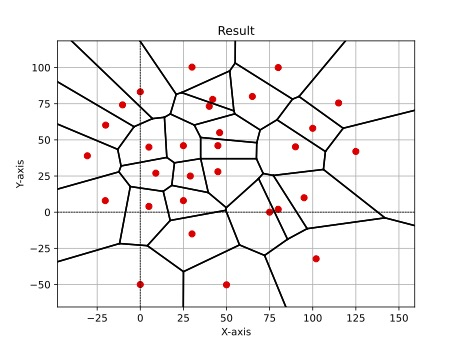
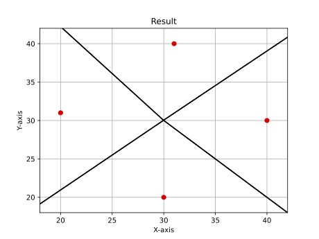

## Second Project of the Course DM819 Computational Geometry

This project was developed together with my fellow student [@jonas-bork](https://github.com/jonas-bork).

The project implements **Fortune's algorithm** as described in *Computational Geometry: Algorithms and Applications (3rd Edition)* to compute Voronoi diagrams in time $O(n \log n)$.

To simplify the problem, we assume the input points are in *general position*. Specifically, the input points satisfy the following conditions:

- All points are distinct.
- No four points lie on a common circle.
- No two points share the same $x$-coordinate.
- No two points share the same $y$-coordinate.
- All points are in the plane.

As we assume the input is in general position, we do not have any *special cases* to consider.

Visual results from testing the algorithm on different input point configurations:
<p align="center">
  
  
</p>
The images above showcase the computed Voronoi diagrams for two different test cases. On the left is the result for a larger dataset (`data/test-big.txt`), demonstrating the algorithm's handling of numerous points. On the right is the result for points arranged in a square configuration (`data/test-square.txt`), illustrating its behavior on structured input.


> [!IMPORTANT]
> Please note that the git commit history might not fully reflect the individual contributions, as we pair programmed using the [VS Code Live Share extension](https://marketplace.visualstudio.com/items/?itemName=MS-vsliveshare.vsliveshare).


> **Citation:**  
> de Berg, M., Cheong, O., van Kreveld, M., & Overmars, M. (2008). *Computational Geometry: Algorithms and Applications* (3rd ed.). Springer.

---

## Manual

**Setup:**
After having cloned and possibly created and activated a virtual environment, install dependencies: 

```bash
pip install -r requirements.txt
```

**Execution:**

The program reads point data (x y pairs, one per line) from standard input. You can provide this in two main ways:

1.  **Using Input Redirection from a file:**
    Pipe the contents of a data file (e.g., one from the `data/` directory) into the script.
    ```bash
    python3 src/prog.py < data/test-big.txt
    ```
    *(Replace `data/test-big.txt` with the desired input file path)*

2.  **Using Manual Standard Input:**
    Run the script and type/paste the point coordinates directly into the terminal, pressing Enter after each `x y` pair.
    ```bash
    python3 src/prog.py
    ```
    Then type your points:
    ```
    10 20
    35.5 42.1
    ... (more points) ...
    ```
    Signal the end of input when finished:
    *   `Ctrl+D` on macOS/Linux
    *   `Ctrl+Z` then `Enter` on Windows

**Output:**

*   **Textual:** The computed edges and vertices of the Voronoi diagram (as a Doubly-Connected Edge List) will be printed to the standard output (your terminal). Infinite half-edges are indicated with `inf(...)`.
*   **Visual:** A PDF file named `result.pdf` will be generated in the project's root directory, visualizing the Voronoi diagram using Matplotlib. Sites are red dots.

---

## Testing

This project includes both unit tests and end-to-end test files.

**Unit Tests:**

Critical components and helper functions are tested using `pytest`. Ensure your virtual environment is activated and dependencies are installed.

Run all unit tests using:
```bash
  pytest
```

**End-To-End Tests:**
These are the files located in the `data` folder, which can be run as described above in the "Using Input Redirection from a file" section.
